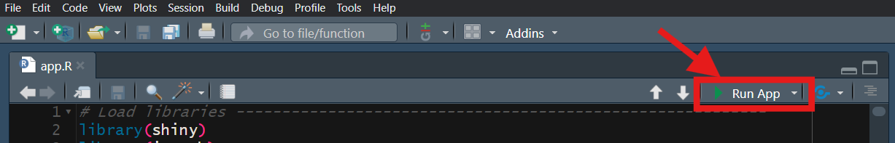

# Global Patterns of Multidimensional Poverty

This repository contains all files and code to reproduce the findings of the paper "Global Patterns of Multidimensional Poverty: a Markov network approach to deprivation interlinkages analysis", by Girela, I., García Arancibia, R. & Koplin, E.

### Abstract

### Explore our findings using the Shiny app!

Ready to dive in and explore the findings yourself? This guide will walk you through the steps to reproduce everything.

##### **Step 1: Get the Code**

First, you'll need to clone the project repository.

1.  **Choose a Destination:** Open your terminal or command prompt and navigate to the directory where you'd like to download the project files. For example, on Windows, you might use:

    `cd C:/Users/YourUsername/Documents`

(Replace "YourUsername" with your actual username.)

2.  **Verify Git Installation:** Before cloning, let's quickly check if Git is installed on your system. Run the following command in your terminal:

    `git --version`

If Git is installed, you'll see its version information. If not, you'll need to install it. You can download Git from <https://git-scm.com/downloads>. Follow the installation instructions for your operating system.

3.  **Clone the Repository:** Now, let's download the project files. Use the following command, which will create a new folder named `DiscreteMarkovNetworkMPI` in your chosen directory:

    `git clone https://github.com/girelaignacio/DiscreteMarkovNetworkMPI.git`

##### **Step 2: Launch the Application**

Once the repository is cloned, you can run the application to explore the findings.

1.  **Navigate to the App Folder:** Open the newly created `DiscreteMarkovNetworkMPI` folder and then navigate into the `app` subfolder.

2.  **Open `app.R`:** Locate the file named `app.R` within the `/app` folder and open it using RStudio or your preferred R environment.

3.  **Run the App:** In your R environment, execute the code within the `app.R` file. This will launch the application, allowing you to interact with the findings directly!

